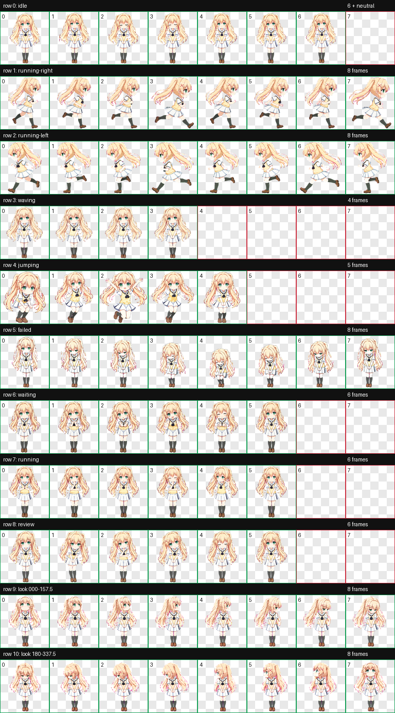

# 紬文德斯 / Tsumugi Wenders



以暖金色双马尾、绿色眼睛、粉色 X 发夹和水手制服为核心特征制作的 Codex v2 动态角色形象。形象气质参考[萌娘百科角色资料](https://zh.moegirl.org.cn/%E4%8C%B7%E6%96%87%E5%BE%B7%E6%96%AF)，呈现认真、坦率、温柔又好奇的性格。

## Install

From the repository root:

```bash
mkdir -p ~/.codex/pets/tsumugi-wenders
cp pets/tsumugi-wenders/pet.json ~/.codex/pets/tsumugi-wenders/
cp pets/tsumugi-wenders/spritesheet.webp ~/.codex/pets/tsumugi-wenders/
```

然后在 ChatGPT 桌面应用的 **Settings → Pets** 中刷新并选择“紬文德斯”。

## Validation

- Sprite contract: v2
- Atlas: `1536 × 2288`, RGBA WebP, `8 × 11`
- Standard animations: 9 rows
- Look directions: 16
- Transparent RGB residue: 0 pixels
- Deterministic atlas validation: passed with no errors or warnings
- Three independent blind direction reviews and final visual QA: passed

查看[16 向视线图](previews/look-directions.png)与[完整验证结果](qa/validation.json)。

## Notice

This is unofficial fan-made artwork for personal customization. The underlying character and design belong to their respective rights holders.
